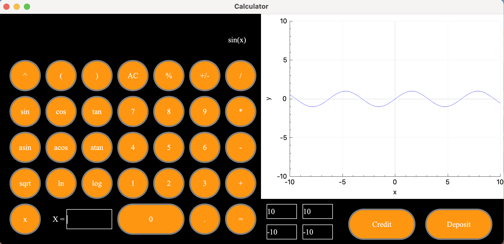
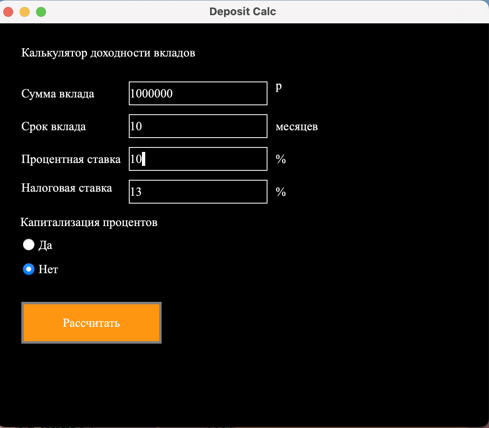
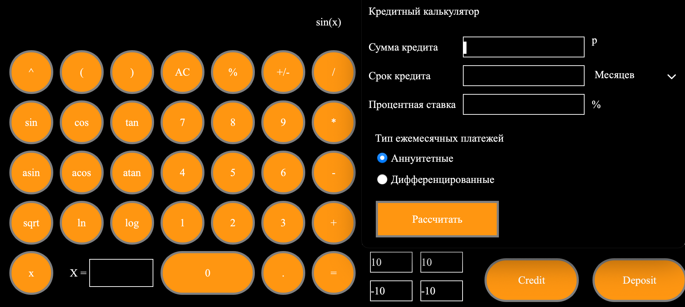

# SmartCalc v1.0

## Contents

1. [Установка](#installation)
2. [Калькулятор](#calc)
3. [График](#graph)
3. [Депозит](#deposit)
4. [Кредит](#credit)

## Установка
Для установки находясь в папке src введите команду:

> make install

Он создаст создаст папку build и поместит туда исполнительный файл, а также все файлы нужные для запуска приложения 

## Калькулятор

## График

## Калькулятор вкладов 

## Калькулятор кредита

